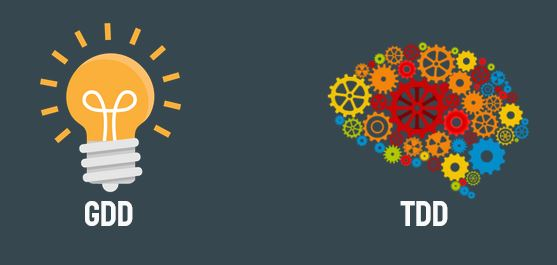

# Tech Design Document Research

## Introduction
This is a webpage created for hosting a research I did about Tech Design Document for the subject Project II while I was coursing my Degree in Game Desing & Development in CITM-UPC.

In this website we will see why big companies use the TDD and how they create it. We will cover and explain every section carefully.

## What's a Technical Design Document?
The Technical Design Document (TDD) is an essential piece that goes hand by hand with the Game Design Document (GDD) and the Art Bible.
The TDD should be located on an internal website and has to be updated constantly throughout  the project realization. In our case, in a GitHub Wiki.

While the GDD is giving a detailed explanation of the idea that will be in the game the TDD takes those ideas and provides all  the required technical information for that idea in order to work on the game as the GDD expects.
GDD and TDD work together all the time for the sake of implementing all the aspects of the game as the developer team desires.

We were saying that the TDD and the GDD work together, but what are differences between them?  Let’s dig in on this detailed explanation.
The GDD is the core of all the documents. It includes everything that comes from the concepts and the ideas.
On the other hand the TDD provides a blueprint for the engineers working on the code. It includes everything related to the tools and technology required to develop the game.

Now, let’s take a look at this Valheim gif!
We can see that there’s fog in the environment, we can different effects in screen and there’s a UI too.

This aspects of the game are in both documents:
The GDD contains the concept and the idea.
The TDD contains the technical data to make it real.

## Document Overview
This are the essential documents for a successful game development.
We already have seen the **Production Plan, Art Bible and Audio Bible** in class!

And now that we located ourselves, let’s see how to do it!

## How to do a Technical Design Document?
The TDD is composed in 5 parts.
We will see and explain carefully every one of them with its sub sections.

### 1. Game Overview
#### Game Summary
What is your game about? You have to give a very short and general summary of what happens in your game.
Does your main character destiny to fight the demon king? Write it down here.

#### Platform Target
What platform your game will be releasing? Is it PC, or maybe Consoles?

What will you use to control the game? Keyboard or Gamepad, or both?
Answer all this questions in this section!

What are the minimum requirements of your game in order to play it in a solid 60 fps in a computer? What hardware should that computer have to be able to play it?

### 2. Development Overview
#### Development Team
Every person in the team must be here. It has to be recorded which role every coworker has.

It is encouraged to give a short description in one line of what exactly this person will do in the project.

#### Development Environment
In which library and language will be written all the game?
##### **Development Hardware**
What are the requirements of the software you are using?
##### **Development Software**
Which software will be using the team for the development?

#### GitHub Branching

How your team will manage the branches on GitHub? 
Here’s a tip: Use 3 different branches.
Master branch: Only for release purpose. Merging from the dev branch.

Development branch: One main branch + temporal branch for each new feature.

Bug Fixing branch: Only for fixing bugs.

### 3. Technical Features
#### Technical Requirements
List all the main technical features of your game.

Example:

The game increases the difficulty by leveling up the life and damage of the monsters.

#### Module Architecture
What module structure do we have in our project?

What happens in that module in particular?

Do not provide a scheme, what we want here is to list what each module does.

#### Game Flow
Explain everything that happens in a  game loop. Think of it like a guided tour of your game. 

A scheme might be really useful here too.

#### Graphics
The screen resolution, tile size and camera view should be documented here in a few lines specifying its characteristics.

What visual style the game will have? Describe the visual techniques what will be used. Which particles will be used on the game?

#### Audio
Specify what music or sound will be heard in what moment on the game.

#### Artificial Intelligence
What enemies in your game do have intelligence?

Do they attack trying to discover your weaknesses?

Write how every enemy works.

Example:
When you kill an enemy, it drops an item. 

Explain how the AI you implemented manages an item pool checking your current level.

#### Physics
Explain what object in your game has collisions and the reason for it.

Useful for explaining specific functionalities that may be difficult to remember.

#### Data Management
How the data will be managed? Saved on an XML?

When will it Save or Load? Checkpoints?

### 4. Code Style
#### Naming Conventions
General guideline on how your code should be written. Essential section for your team to be able to read and understand code from other coworkers.

Take a look at Ray’s code conventions for a good reference on how it’s done.

#### XML Structure
Structure of your game xml. Useful guideline while developing.

Here you can visualize all the structure your xml should have, in case you don’t remember it.

You can use the xml we used in Video Game Development class last semester as a reference.

#### UML

Structure of all the modules in the game.
The scheme should be very simple to be able to understand the module structure in seconds.

You have lots of references on the internet. 
A useful reference I found for you is this UML from this CITM students project.

### 5. Technical Risk

Analyze the any lack the team might have in this project. This is useful to be able to see which part will be more difficult than another and strengthen it for the sake of making a solid project.

Is the library new to us? We didn’t work yet with this type of game?
All this questions can be answered here.

## Conclusion
In general, the TDD may vary depending on the company, project, necessities, etc.

This is the template prepared for the class. It includes everything that we covered in the class.

Feel free to change the template for your necessities, always checking references, of course.

## Template
 + [TDD Template](https://github.com/Hydeon-git/research_TDD/blob/research/template/template_TDD.md)

## GitHub Repository
 + [Github Repo](https://github.com/Hydeon-git/research_TDD/tree/research)

## Bibliography
This are the resources i've been used for the research. Feel free to check them out!

https://www.studytonight.com/3d-game-engineering-with-unity/tdd-and-gdd

https://github.com/GameDesign/Zero/wiki/Technical-Design-Document#Development_Hardware

https://github.com/DevCrumbs/Warcraft-II/wiki/7.-Tech-Design-Document

https://www.reddit.com/r/gamedev/comments/5sa9rz/how_to_find_minimum_system_requirements/

https://www.youtube.com/watch?v=jT_zOr7bElY

https://www.gamedev.net/forums/topic/685673-should-the-gdd-contain-the-gui-layout/5328875/
